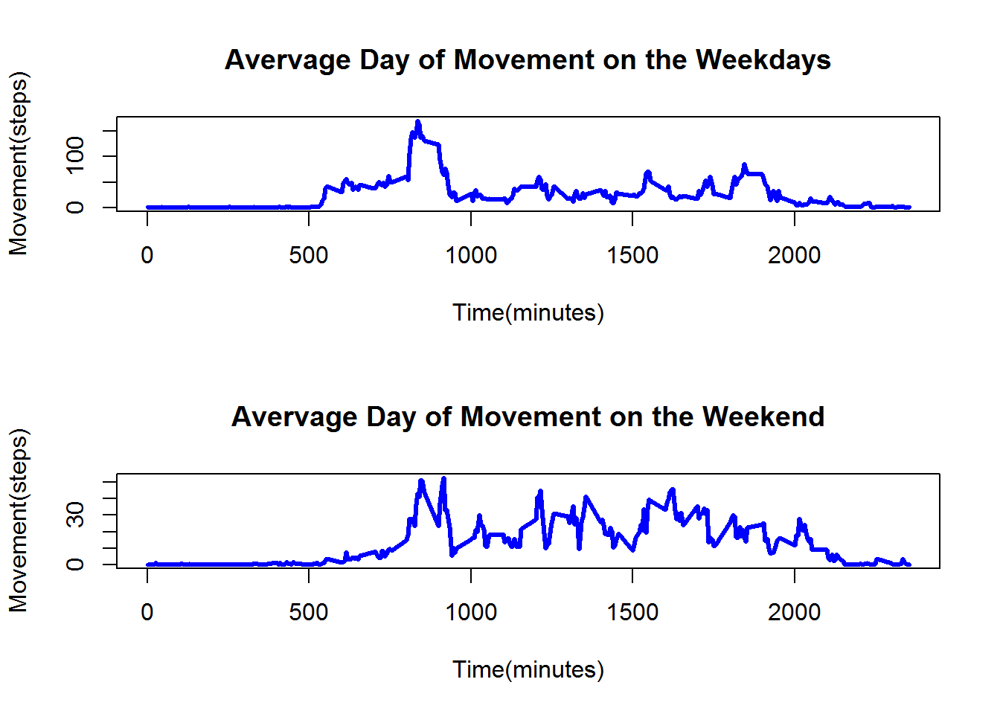

# Personal Movement Study
Andres Cubas  
December 19, 2015  

To make sure that the figures are saved in a directory in the repository we need to apply the following change:


```r
knitr::opts_chunk$set(fig.path='figure/')
```

This report uses the follow package throughout the analysis: 


```r
library(data.table)
```

### Loading and Preprocessing the Data

The following is used to unload the data from `activity.zip` found in the repository:

```r
unzip("activity.zip")
DT <- read.csv("activity.csv")
```

### What is mean total number of steps taken per day?

This code computes and plots a histogram of the total number of steps taken each day that was recorded.


```r
DTstepsum <- tapply(DT$steps, DT$date, sum, na.rm = TRUE)
dates <- as.Date(names(DTstepsum))
plot(dates, DTstepsum, type = "h", lwd = 3, col = "orange", xlab = "Time(days)", ylab = "Movement(steps)", main = "Histogram for Movement versus Steps per Day")
abline(h = mean(DTstepsum), col = "blue", lwd = 3)
abline(h = median(DTstepsum), col = "red", lwd = 3)
legend("topleft", legend = c("Mean", "Median"), lwd = c(3,3), col = c("blue", "red"))
```

 

This is the average amount of steps taken in a day:


```r
mean(DTstepsum)
```

```
## [1] 9354.23
```

This is the median amount of steps taken in a day:


```r
median(DTstepsum)
```

```
## [1] 10395
```

### What is the average daily activity pattern?

This code computes and plots a time series plot of the average day of the ones that were recorded.


```r
rng <- range(as.Date(DT$date))
nDay <- as.numeric(rng[2] - rng[1])
sumDay <- tapply(DT$steps, DT$interval, sum, na.rm = TRUE)
avgDay <- sumDay / nDay
plot(names(avgDay),avgDay, type = "l", lwd = 3, col = "blue", main = "Avervage Day of Movement", xlab = "Time(minutes)", ylab = "Movement(steps)")
```

 

The time interval with the largest average step count is:

```r
names(which(avgDay == max(avgDay)))
```

```
## [1] "835"
```

### Imputing missing values

This is the number of `NA`'s recorded in the Data given:

```r
sum(is.na(DT$steps))
```

```
## [1] 2304
```

The following is how the table was rectified to convert the `NA` entries to average values for their specific 5-minute interval.


```r
fixedDT <- DT
for(i in 1:nrow(fixedDT)){
  if(is.na(fixedDT$steps[i])){
    fixedDT$steps[i] <- avgDay[as.character(fixedDT$interval[i])]
  }
}
```

This code computes and plots a histogram of the total number of steps taken each rectified day recorded.


```r
fixedDTstepsum <- tapply(fixedDT$steps, fixedDT$date, sum)
fixeddates <- as.Date(names(fixedDTstepsum))
plot(fixeddates, fixedDTstepsum, type = "h", lwd = 3, col = "orange", xlab = "Time(days)", ylab = "Movement(steps)", main = "Histogram for Movement versus Steps per Day (NA's replaced)")
abline(h = mean(fixedDTstepsum), col = "blue", lwd = 3)
abline(h = median(fixedDTstepsum), col = "red", lwd = 3)
legend("topleft", legend = c("Mean", "Median"), lwd = c(3,3), col = c("blue", "red"))
```

 

This is the new average amount of steps taken in a day:


```r
mean(fixedDTstepsum)
```

```
## [1] 10601.46
```

This is the new median amount of steps taken in a day:


```r
median(fixedDTstepsum)
```

```
## [1] 10395
```

It appears that the mean increase but the median remained the same after rectifying the `NA` values.

### Are there differences in activity patterns between weekdays and weekends?

This code computes and plots a time series plot of the average day for the weekend and weekdays repectively of the ones that were recorded.


```r
weekDT <- fixedDT
weekDT$weektype <- as.factor(ifelse(weekdays(as.Date(fixedDT$date)) %in% c("Saturday","Sunday"),"weekend", "weekday"))

weekdayDT <- weekDT[which(weekDT$weektype == "weekday"),]
weekendDT <- weekDT[which(weekDT$weektype == "weekend"),]

rngD <- range(as.Date(weekdayDT$date))
rngE <- range(as.Date(weekendDT$date))

nDayD <- as.numeric(rngD[2] - rngD[1])
nDayE <- as.numeric(rngE[2] - rngE[1])

sumDayD <- tapply(weekdayDT$steps, weekdayDT$interval, sum)
sumDayE <- tapply(weekendDT$steps, weekendDT$interval, sum)

avgDayD <- sumDayD / nDayD
avgDayE <- sumDayE / nDayE

par(mfrow=c(2,1))

plot(names(avgDayD),avgDayD, type = "l", lwd = 3, col = "blue", main = "Avervage Day of Movement on the Weekdays", xlab = "Time(minutes)", ylab = "Movement(steps)")

plot(names(avgDayE),avgDayE, type = "l", lwd = 3, col = "blue", main = "Avervage Day of Movement on the Weekend", xlab = "Time(minutes)", ylab = "Movement(steps)")
```

 
